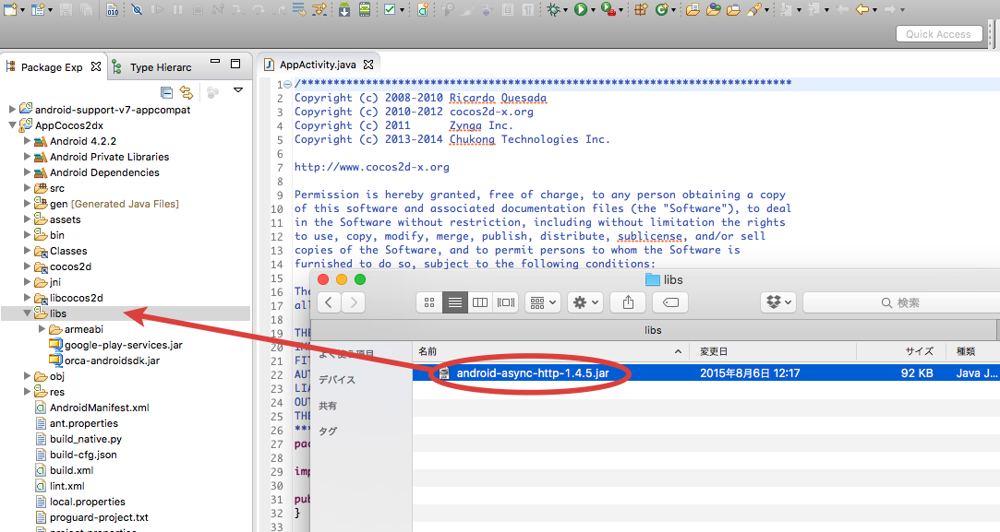
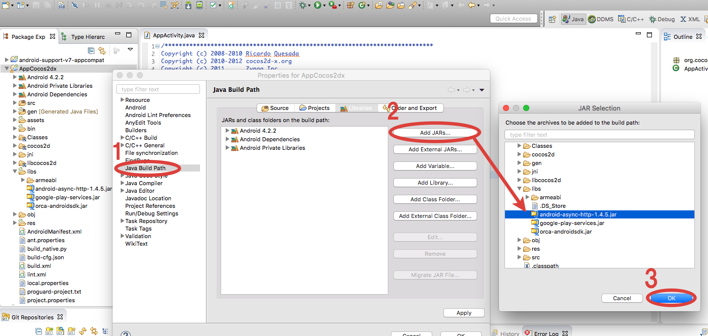

## 导入Android Asynchronous Http Client

按照下面步骤向Eclipse项目导入「android-async-http-x.x.x.jar」文件。

* 拷贝「android-async-http-x.x.x.jar」到项目工程中「libs」文件下。

* 选择Aplication，右键选择【property】打开Property窗口
* 选择Property窗口左侧菜单【Java Build Path】
* 点击Propety窗口右侧的【Library]标签，选择【Add Jar...】
* 选择Application的【libs】下面「android-async-http-x.x.x.jar」文件

