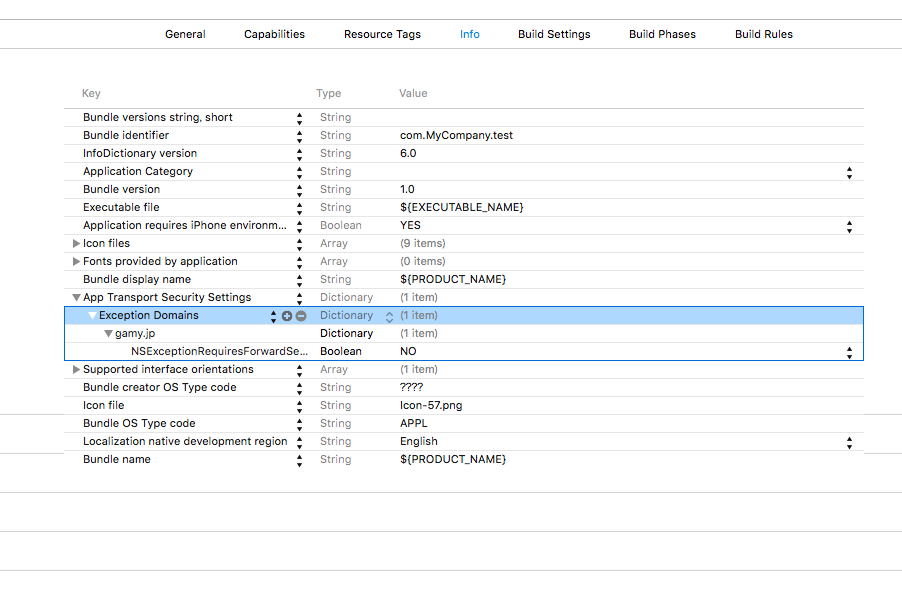

## 關於App Transport Security的無效設置

若ATS有效，請在Info.plist裡添加ATS的無效設置。

```
<key>NSAppTransportSecurity</key>
<dict>
  <key>NSExceptionDomains</key>
  <dict>
    <key>gamy.jp</key>
    <dict>
      <key>NSExceptionRequiresForwardSecrecy</key>
      <false/>
    </dict>
  </dict>
</dict>
```


