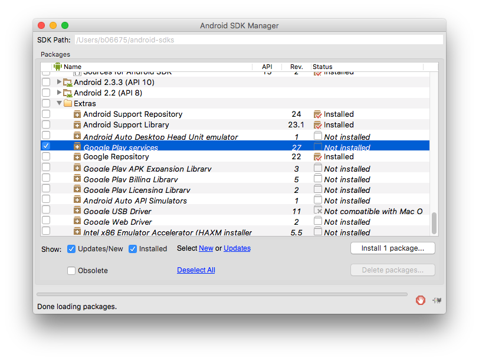
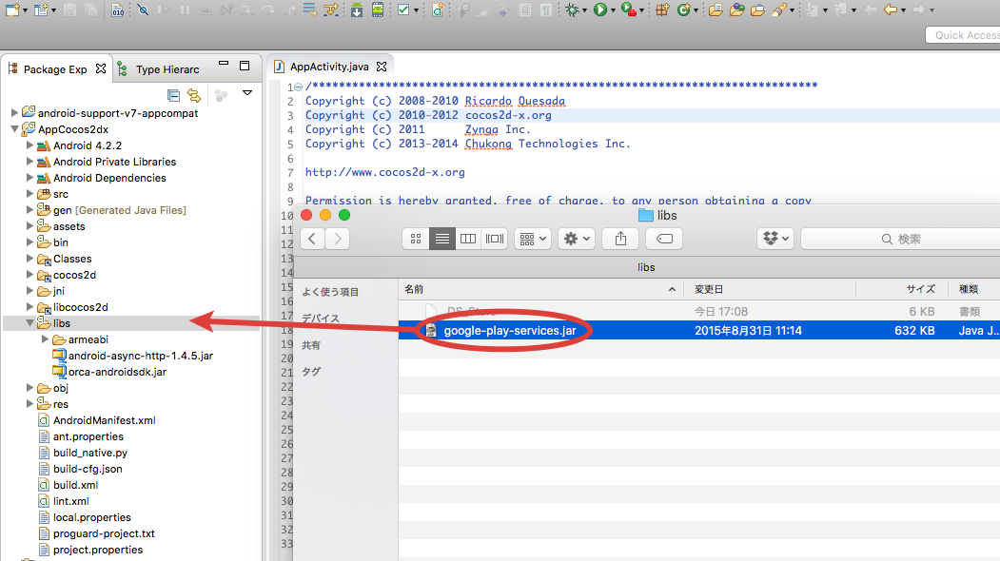
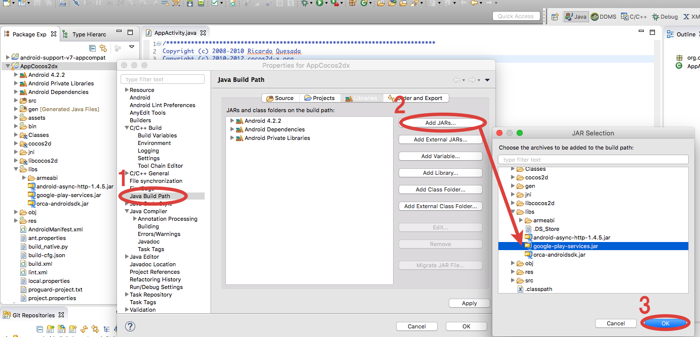

## 取得Google Play Services SDK

以下是2014年11月以后Google Play Services SDK的导入方法。
没有安装Google Play Services的情况下，从Android SDK Manager获得安装包。

* 启动Android SDK Manager。
* 勾选Extras下的Google Play services，安装。

## 取得google-play-services.jar

访问下面的路径获取「google-play-services.jar」。

{android-sdk}/extras/google/google_play_services/libproject/google-play-services_lib/libs/google-play-services.jar

## 导入Google Play Services

取得的「google-play-services.jar」以外部jar的形式导入工程。

* 拷贝「google-play-services.jar」到项目工程中「libs」文件下

* 选择Aplication，右键选择【property】打开Property窗口
* 选择Property窗口左侧菜单【Java Build Path]
* 点击Propety窗口右侧的【Library]标签，选择【Add Jar...]
* 选择Application的【libs】下面「google-play-services.jar」文件

