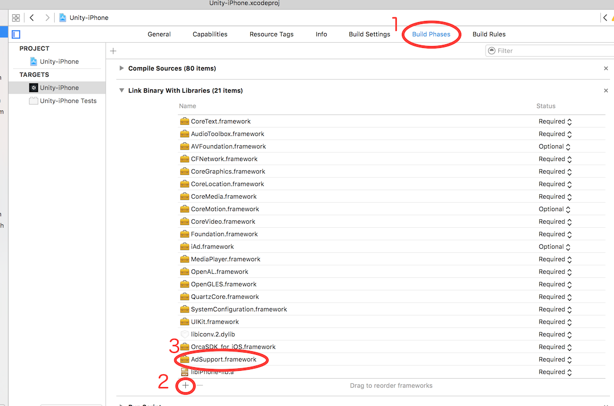

## AdSupport导入(Unity)

### 1. Adsupport.framework追加（Unity5以降）
1. Unity项目里选择"OrcaSDK_for_iOS.framework"。
2. 勾选Inspector的"Platform settings"的"Framework dependencies"里面的"Adsupport"

### 2. Adsupport.framework追加（Unity4以前）

1. 打开从Unity导出的Xcode项目，点击对象的"Build Phasees"选项。
2. 点击"Linked Frameworks and Libraries"按钮。
3. 添加"Adsupport.framework"。

