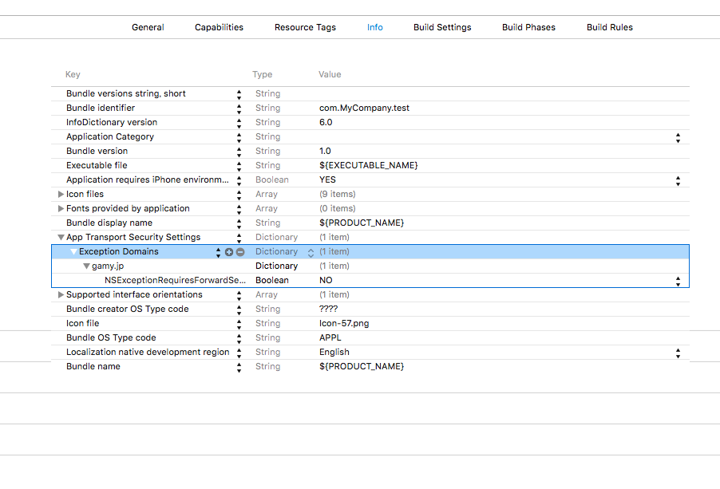

## App Transport Security の例外設定

ATSを有効にしている場合、ATS例外設定をInfo.plistに追加して下さい。

```
<key>NSAppTransportSecurity</key>
<dict>
  <key>NSExceptionDomains</key>
  <dict>
    <key>gamy.jp</key>
    <dict>
      <key>NSExceptionRequiresForwardSecrecy</key>
      <false/>
    </dict>
  </dict>
</dict>
```


