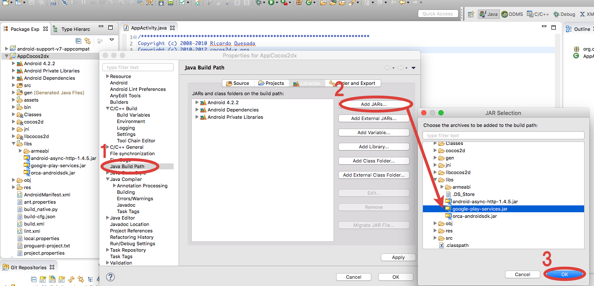

## Google Play Services SDKの取得

以下に、2014年11月時点での、Google Play Services SDKの導入方法を記載致します。
Google Play Services SDKをインストールしていない場合は、Android SDK Managerからパッケージを取得します。

* Android SDK Managerを起動します。
* Extrasディレクトリ配下のGoogle Play servicesにチェックをいれ、パッケージをインストールします。

## google-play-services.jarの取得

以下のPATHで「google-play-services.jar」を取得してください。

{android-sdk}/extras/google/google_play_services/libproject/google-play-services_lib/libs/google-play-services.jar

## Google Play Servicesの導入

取得した「google-play-services.jar」を外部jarとして追加する方法は以下の通りで雨s。

* アプリケーションプロジェクトの「libs」フォルダー配下に「google-play-services.jar」をコピー

* アプリケーションを選択し、右クリック>「プロパティ」を選択するとプロパティウィンドウが立ち上がる
* プロパティウィンドウの左のメニューから「Javaのビルド・パス」を選択
* プロパティウィンドウの右側の「ライブラリー」タブを選択し、「Jar追加」を選択します
* アプリケーションの「libs」フォルダに配置した「google-play-services.jar」を選択する

