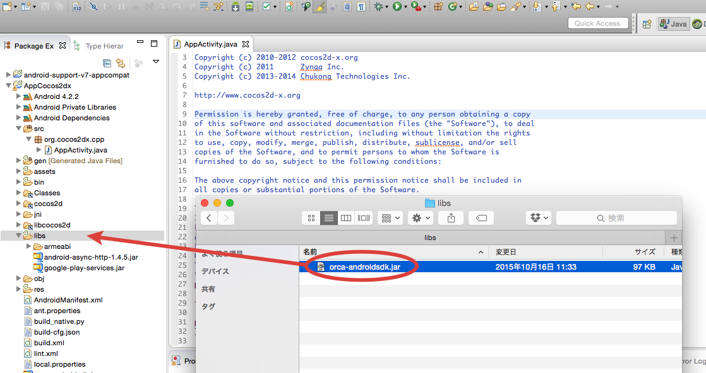
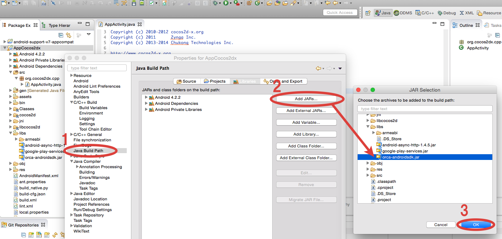

## Eclipseプロジェクトへの導入

Eclipseプロジェクトへ「orca-androidsdk.jar」を外部jarとして追加する方法は以下の通りです。

* アプリケーションプロジェクトの「libs」フォルダー配下に「orca-androidsdk.jar」をコピー

* アプリケーションを選択し、右クリック>「プロパティ」を選択するとプロパティウィンドウが立ち上がる
* プロパティウィンドウの左のメニューから「Javaのビルド・パス」を選択
* プロパティウィンドウの右側の「ライブラリー」タブを選択し、「Jar追加」を選択します
* アプリケーションの「libs」フォルダに配置した「orca-androidsdk.jar」を選択する

