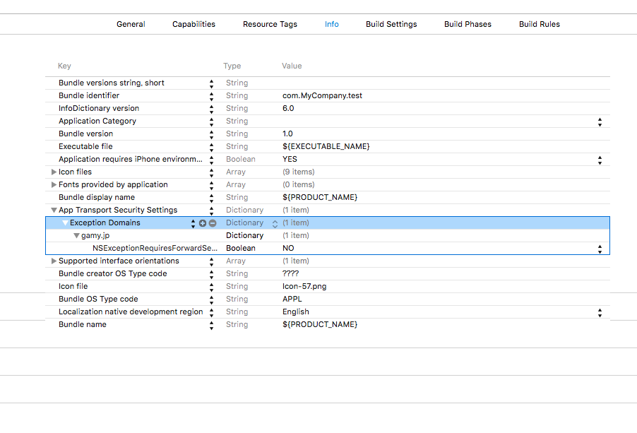

## App Transport Security의 예외설정

ATS를 유효화 한 경우、ATS예외설정을 Info.plist에 추가 하십시오.

```
<key>NSAppTransportSecurity</key>
<dict>
  <key>NSExceptionDomains</key>
  <dict>
    <key>gamy.jp</key>
    <dict>
      <key>NSExceptionRequiresForwardSecrecy</key>
      <false/>
    </dict>
  </dict>
</dict>
```


