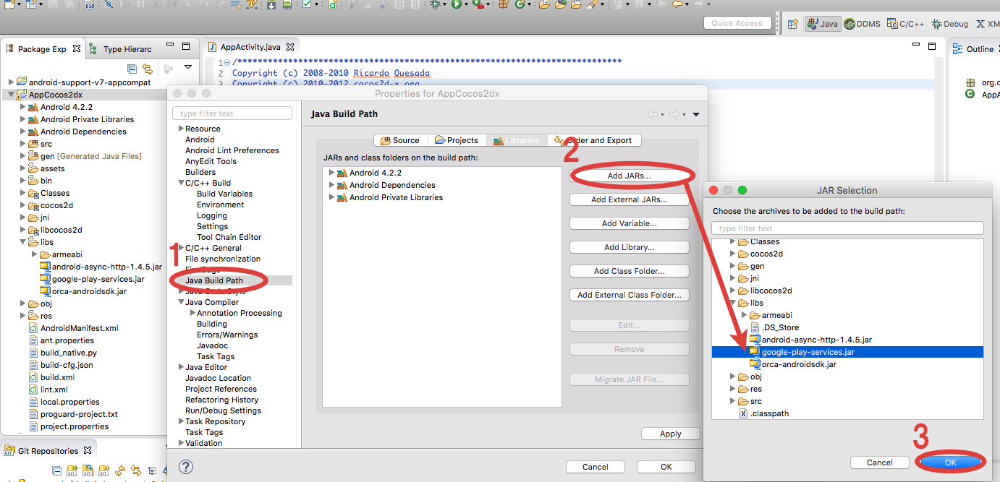

## Google Play Services SDK의 취득

아래、2015년11월 지점으로써、Google Play Services SDK의 도입방법을 기재합니다.
Google Play Services SDK를 인스톨 하지 않은경우는、Android SDK Manager로부터 패키지를 취득합니다.

* Android SDK Manager를 기동합니다.
* Extras디렉토리 아래의Google Play services에 체크를 하고、패키지를 인스톨 합니다.

## google-play-services.jar의 취득

아래의 PATH에서「google-play-services.jar」를 취득하여 주십시오.

{android-sdk}/extras/google/google_play_services/libproject/google-play-services_lib/libs/google-play-services.jar

## Google Play Services의 도입

「google-play-services.jar」를 외부jar으로써 추가하는 방법은 아래와 같습니다.

* 앱 프로젝트의「libs」폴더 아래에「google-play-services.jar」를 복사.

* 앱 선택 > 오른쪽 클릭 > 「프로파티」를 선택하여 프로파티 창을 띄웁니다.
* 프로파티 창 왼쪽 메뉴에서「Java빌드 패스」를 선택
* 프로파티 창 오른쪽에「라이브러리」를 선택하여、「Jar추가」를 선택.
* 앱의「libs」폴더의「google-play-services.jar」를 선택.

