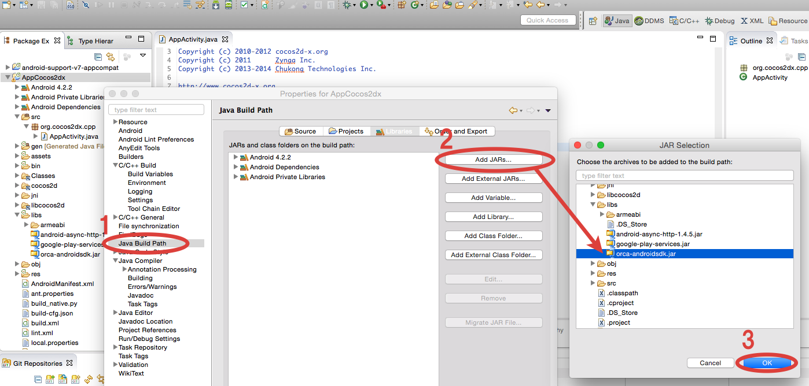

## Eclipse프로젝트에 도입

Eclipse프로젝트에「orca-androidsdk.jar」를 외부jar로써 추가하는 방법은 아래돠 같습니다.

* 앱 프로젝트의「libs」폴더 아래에「orca-androidsdk.jar」를 복사하여 주십시오.

* 앱 선택 > 오른쪽 클릭 > 「프로파티」를 선택하여 프로파티 창을 띄웁니다.
* 프로파티 창 왼쪽 메뉴에서「Java빌드 패스」를 선택
* 프로파티 창 오른쪽에「라이브러리」를 선택하여、「Jar추가」를 선택.
* 앱의「libs」폴더의「orca-androidsdk.jar」를 선택.

