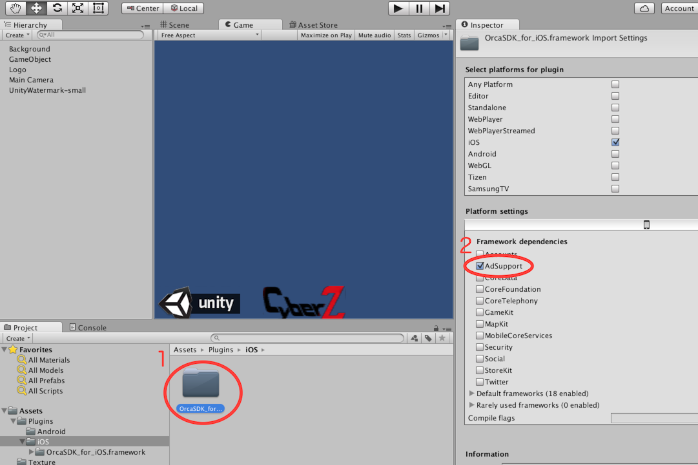

## AdSupport의 도입(Unity)

### 1. Adsupport.frameworkの追加（Unity5이후）
1. Unity프로젝트에서 "OrcaSDK_for_iOS.framework"를 선택.
2. Inspector의"Platform settings"의"Framework dependencies"안에 있는"Adsupport"에 체크를 클릭.

### 2. Adsupport.framework의 추가（Unity4이전）

1. Unity로 부터 output된 Xcode의 프로젝트를 열어、대상Target의"Build Phasees"를 표시.
2. "Linked Frameworks and Libraries"의 +버튼을 누름.
3. "Adsupport.framework"를 추가.

